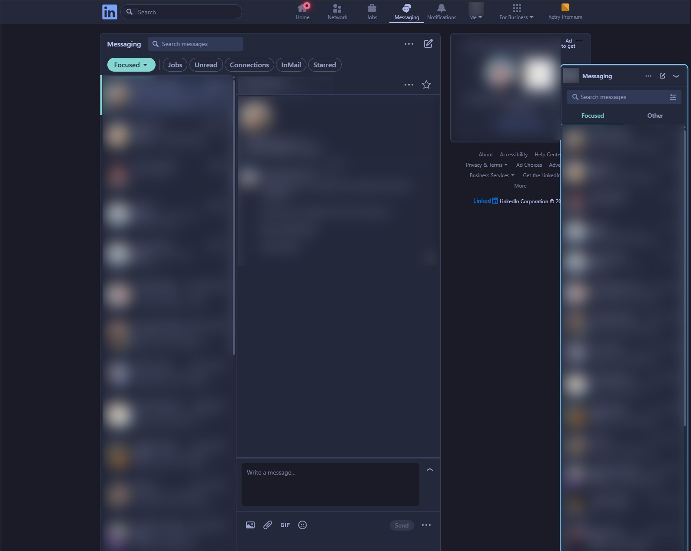
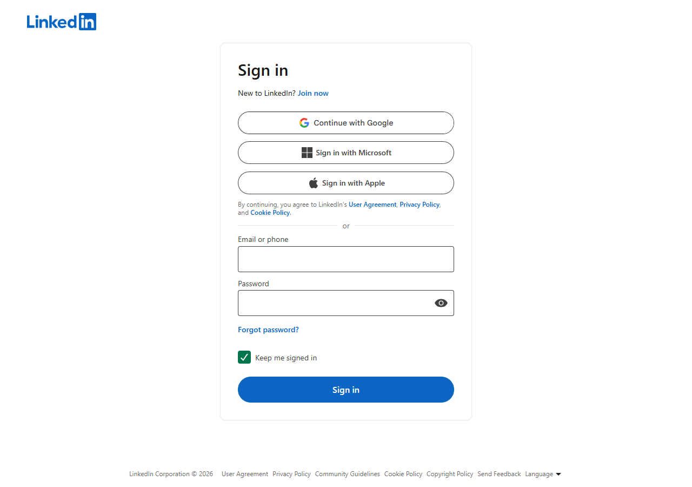
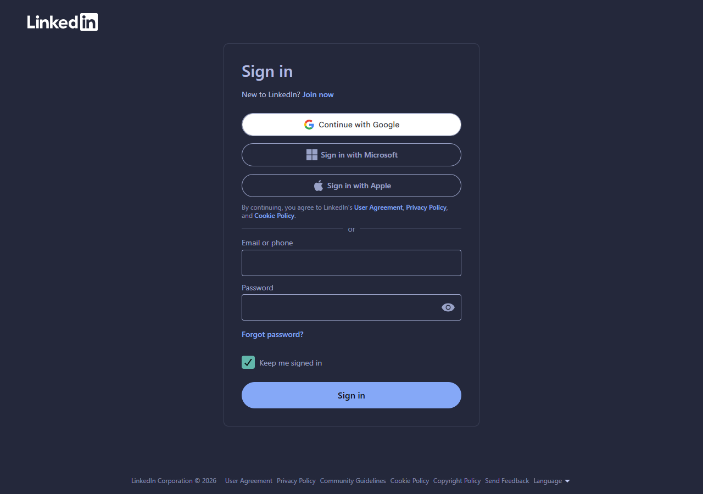

# LinkedIn - Tokyo Night Storm

A dark [Tokyo Night Storm](https://github.com/enkia/tokyo-night-vscode-theme) theme for
[linkedin.com](https://www.linkedin.com). Built for [Stylus](https://github.com/openstyles/stylus).

**[Install](https://raw.githubusercontent.com/antenando/linkedin-tokyonight/main/linkedin-tokyonight.user.css)**
· with Stylus installed, opening that link offers to install it.

**Turn on LinkedIn's own dark mode too:** Me → Settings & Privacy → Display → Dark mode.
Some newer LinkedIn components only switch their text colours under LinkedIn's dark mode
attribute, which a stylesheet cannot set. With LinkedIn in light mode, those components
(for example the "Manage my network" list) show dark text on the dark theme.

## Screenshots

Messaging, with the notification badge in neon red (names, photos and messages blurred):



The sign-in page without the style, then with it:





## What it does

LinkedIn uses two colour systems at the same time. The style remaps both, so every page
follows the theme.

- **Named tokens** (`--color-background-canvas`, `--color-text`, ...) on the older pages.
  The main roles (page, cards, text, links, buttons) are set by hand. The other tokens are
  converted from light to dark by the generator.
- **Hashed tokens** (`--_5fa42b79`, ...) on the newer pages. These pick their colour with
  `light-dark()`, so the style forces `color-scheme: dark` and remaps the palette under
  them. Greys go to a Tokyo Night grey ramp, hues to the nearest Tokyo Night accent at a
  matching lightness.

## Settings

Configurable from the Stylus style settings:

| Setting | Default |
|---|---|
| Page background | `#1a1b26` |
| Card background | `#24283b` |
| Body text | `#c0caf5` |
| Links and actions | `#7aa2f7` |
| Notification badge | `#ff2a55` (neon red, with a glow) |

The whole grey ramp is derived from these through `color-mix()`, so retinting the
background or the text retints every grey on the site.

## What is stable and what is not

- **Stable:** the named tokens, the forced dark scheme and the few class rules. Messaging,
  notifications and the top bar run in LinkedIn's older app, which uses named tokens, so
  those stay Tokyo Night across LinkedIn releases.
- **Best effort:** the hashed tokens. LinkedIn renames them on every build, often within
  days. While they match, the newer pages are full Tokyo Night. When they stop matching,
  those pages fall back to LinkedIn's own dark palette: dark and readable, but warm grey
  instead of Tokyo Night.

## When LinkedIn changes its CSS

To refresh the hashed tokens:

```sh
python tools/linkedin-tokyonight-gen.py
```

The script downloads the current stylesheets from LinkedIn's public login and signup pages
and rewrites only the blocks between the `GENERATED` markers.

Signed-in pages load bundles that no public page loads, and those use a third set of
hashed names. To collect them, turn the style off, open the page that looks wrong, paste
`tools/probe.js` into the DevTools console (or a DevTools Snippet, which the console noise
from LinkedIn cannot disturb), and save the `DUMP` section of the downloaded report under
the same name in `tools/dumps/`. The name starts with the date, `YYYY-MM-DD-<page>.txt`.
The generator reads every report in date order. It ignores hashed names from reports older
than 14 days, since LinkedIn has renamed them by then. Tokens set by hand outside
those blocks are kept. Bump `@version` after, or Stylus keeps the old copy.

## Requirements

A browser with `color-mix()` and `light-dark()` support: Chrome 123+, Edge 123+,
Firefox 120+, Safari 17.5+.

## License

MIT
